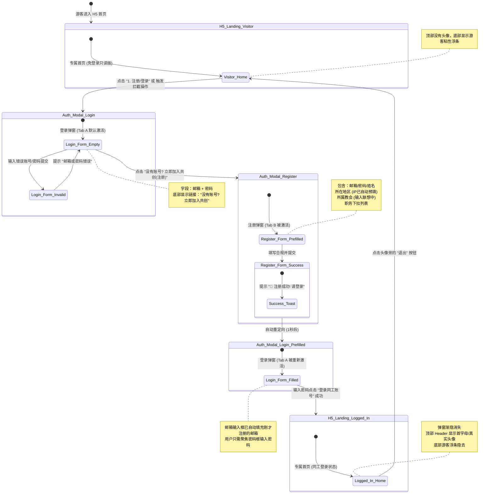

# ChurchOS 教会通 - 注册登录 UI 界面跳转图 (UI Transition storyboard)

本图展示了前台 H5 首页、注册/登录弹窗、输入态以及登录成功后的**UI 页面跳转关系与视觉状态流转**。

### UI 状态流转规范说明：
1. **游客首页状态**：顶部无头像，底部有半透明常驻悬浮栏（快速加入/登录）。
2. **弹窗层级**：以毛玻璃遮罩悬浮在首页之上，首页高斯模糊（Blur 10px）。
3. **注册成功过渡**：注册点击提交 -> 按钮 loading -> 弹出绿色 Toast 提示 -> 弹窗内的 Tab 面板自动向左滑移切换回登录面板，预填邮箱。
4. **同工登录首页状态**：弹窗淡出（Fade-out）消失，首页模糊滤镜移除，顶部 Header 展开个人头像及同工昵称，底部游客常驻浮条彻底消失。
